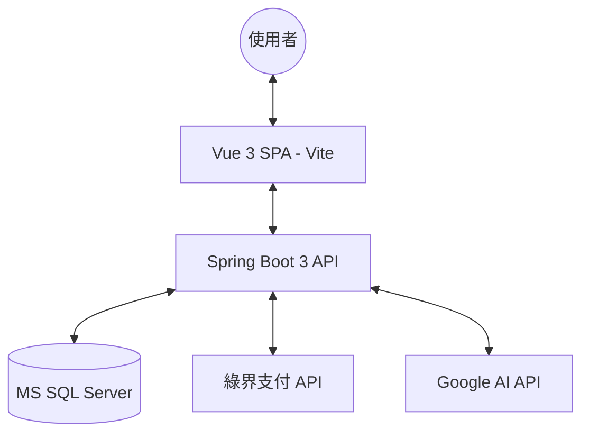

# 📚 BookStore - 全方位線上書城與讀書會平台

[](https://spring.io/projects/spring-boot)
[](https://vuejs.org/)
[](LICENSE)
[](#)

**BookStore** 是一個專為愛書人設計的現代化全端電商平台，結合了「書籍購買」、「讀書會社群」與「AI 智慧推薦」。我們不僅解決了書籍購買的便利性，更透過讀書會機制，連結讀者，打造深度的知識交換社群。

---

## 🚀 核心功能 (Features)

- 🛒 **完整電商流程**：從瀏覽書籍、購物車、折價券應用到訂單管理，一氣呵成。
- 💳 **綠界支付整合**：支援信用卡與超商取貨 (CVS) 地圖選點，提供在地化的支付體驗。
- 📖 **讀書會社群**：會員可自行發起讀書會，具備自動化的審核機制與報名管理。
- 🔐 **安全身分驗證**：採用 JWT (JSON Web Token) 確保 API 呼叫安全，並支援 Google 第三方登入。
- 📊 **後台管理系統**：提供圖表化的訂單統計、庫存紀錄、評論審核與會員管理。

---

## 項目目錄 (Table of Contents)

1. [架構與技術棧](#架構與技術棧)
2. [快速上手指南](#快速上手指南)
3. [環境變數設定](#環境變數設定)
4. [使用說明與 API](#使用說明與-api)
5. [維護與協作](#維護與協作)

---

## 🏗️ 架構與技術棧 (Architecture & Tech Stack)

### 系統架構圖


### 技術棧 (Tech Stack)
- **後端 (Backend)**: Java 17, Spring Boot 3.4.1, Spring Data JPA, Hibernate, JWT, Lombok, Maven.
- **前端 (Frontend)**: Vue 3 (Composition API), Vite, Vuetify 3, Pinia, Axios.
- **資料庫 (Database)**: Microsoft SQL Server.
- **第三方服務**: 綠界支付 (ECPay SDK), Google AI (Gemini), Gmail SMTP.

---

## 🛠️ 快速上手指南 (Getting Started)

### 環境要求 (Prerequisites)
- **Java**: JDK 17+
- **Node.js**: v20.19.0+ / v22.12.0+
- **Database**: MS SQL Server (預設連接埠 1433)
- **Build Tool**: Maven 3.8+

### 安裝步驟 (Installation)

1. **複製專案**
   ```bash
   git clone https://github.com/alex122694/BookStore.git
   cd BookStore
   ```

2. **後端啟動 (Backend)**
   ```bash
   # 確保 SQL Server 已啟動並建立名為 bookstore 的資料庫
   ./mvnw spring-boot:run
   ```

3. **前端啟動 (Frontend)**
   ```bash
   cd bookstore-frontend
   npm install
   npm run dev
   ```

---

## ⚙️ 環境變數與設定 (Configuration)

### Backend (`application.properties`)
請在 `src/main/resources/` 下設定：
- `spring.datasource.url`: 資料庫連線字串。
- `google.ai.api-key`: 您的 Google AI API 金鑰。
- `spring.mail.password`: Gmail 應用程式專用密碼。

### Frontend 環境變數
在 `bookstore-frontend/` 目錄下建立 `.env`：
```env
VITE_API_BASE_URL=http://localhost:8080
VITE_GOOGLE_CLIENT_ID=您的_GOOGLE_CLIENT_ID
```

---

## 📖 使用說明與 API (Usage & API Reference)

### 核心 API 範例
- **結帳請求 (Checkout)**:
  `POST /orders/checkout`
  ```json
  {
    "paymentMethod": "信用卡",
    "deliveryMethod": "宅配",
    "address": "台北市...",
    "items": [...]
  }
  ```
- **讀書會發起**:
  `POST /api/clubs/insert` (需帶帶證明文件 MultipartFile)

### 操作展示
> 我們在 `/docs/screenshots/` 中提供了系統操作的螢幕截圖。

---

## 🛡️ 維護與協作 (Maintenance & Collaboration)

### 測試指南 (Testing)
- **後端測試**: `mvn test` (JUnit 5 / MockMvc)
- **前端測試**: `npx cypress open` (E2E 測試)

### 部署指南 (Deployment)
1. **打包後端**: `mvn clean package` (產生 .war 檔)
2. **打包前端**: `npm run build` (產生 dist 靜態檔案)
3. **Docker 部署**: 專案根目錄提供 `docker-compose.yml` 範例。

### 聯絡資訊
- **作者**: Alex Wang
- **Email**: onlinebookstoreforjava@gmail.com

### 授權條款 (License)
本專案採用 **MIT License**。詳情請參閱 `LICENSE` 檔案。
