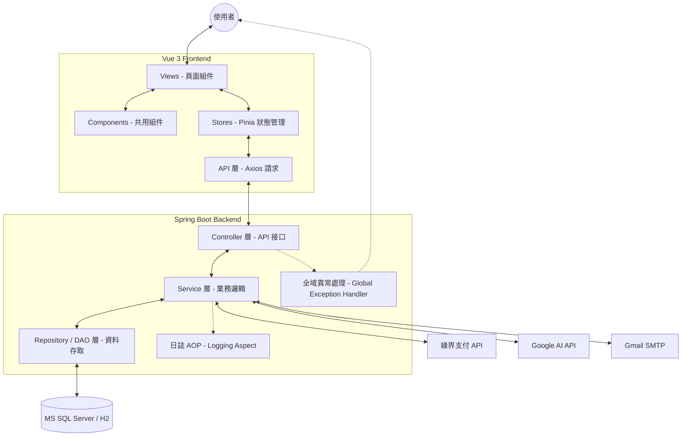

# 📚 BookStore - 全方位線上書城與讀書會平台


**BookStore** 是一個專為愛書人設計的現代化全端電商平台，結合了「書籍購買」、「讀書會社群」。我們不僅解決了書籍購買的便利性，更透過讀書會機制，連結讀者，打造深度的知識交換社群。

---

## 🚀 核心功能 (Features)

- 🛒 **完整電商流程**：從瀏覽書籍、購物車、折價券應用到訂單管理，一氣呵成。
- 💳 **綠界支付整合**：支援信用卡與超商取貨 (CVS) 地圖選點，提供在地化的支付體驗。
- 📖 **讀書會社群**：會員可自行發起讀書會，具備自動化的審核機制與報名管理。
- 🔐 **安全身分驗證**：採用 JWT (JSON Web Token) 確保 API 呼叫安全，並支援 Google 第三方登入。
- 📊 **後台管理系統**：提供圖表化的訂單統計、庫存紀錄、評論審核與會員管理。

---

## 項目目錄 (Table of Contents)

1. [核心功能](#核心功能-features)
2. [架構與技術棧](#架構與技術棧-architecture--tech-stack)
3. [快速體驗指南](#快速體驗指南-demo-quick-start)
4. [開發人員指南](#開發人員指南-development-guide)
5. [環境變數與設定](#環境變數與設定-configuration)
6. [使用說明與 API](#使用說明與-api-usage--api-reference)
7. [維護與協作](#維護與協作-maintenance--collaboration)

---

## 🏗️ 架構與技術棧 (Architecture & Tech Stack)

### 系統架構圖


### 技術棧 (Tech Stack)
- **後端 (Backend)**: Java 17, Spring Boot 3.4.1, Spring Data JPA, Hibernate, JWT, Lombok, Maven.
- **前端 (Frontend)**: Vue 3 (Composition API), Vite, Vuetify 3, Pinia, Axios.
- **資料庫 (Database)**: Microsoft SQL Server.
- **第三方服務**: 綠界支付 (ECPay SDK), Google AI (Gemini), Gmail SMTP.

---

## � 快速體驗指南 (Demo Quick Start)

如果您只想快速體驗本專案的功能，而不打算進行深度開發，您可以利用本專案整合的 **H2 虛擬資料庫** 與 **內建前端網頁**。
(留言功能修正中)

### ⚡ 啟動條件
1.  **安裝 JDK 17**：請確保您的系統已安裝 JDK 17 或更高版本。
2.  **無需資料庫**：專案啟動時會自動在記憶體中建立 H2 資料庫。
3.  **無需前端啟動**：Vue 前端已轉換為後端靜態檔案，直接啟動後端即可存取。

### 🛠️ 啟動步驟
1.  **複製專案**
    ```bash
    git clone https://github.com/alex122694/BookStore.git
    cd BookStore
    ```
2.  **執行專案**
    *   **Windows (CMD/PowerShell)**:
        ```cmd
        mvnw spring-boot:run
        ```
    *   **macOS / Linux**:
        ```bash
        ./mvnw spring-boot:run
        ```
3.  **存取路徑**：啟動完成後，開啟瀏覽器造訪 `http://localhost:8080` 即可開始體驗。

---

## 🛠️ 開發人員指南 (Development Guide)

如果您需要進行功能開發、修改程式碼或使用實體資料庫，請參考以下步驟。

### 環境要求 (Prerequisites)
- **Java**: JDK 17+
- **Node.js**: v20.19.0+ / v22.12.0+
- **Database**: MS SQL Server (預設連接埠 1433)
- **Build Tool**: Maven 3.8+

### 安裝步驟 (Installation)

1.  **複製專案**
    ```bash
    git clone https://github.com/alex122694/BookStore.git
    cd BookStore
    ```

2.  **後端開發啟動 (Backend)**
    ```bash
    # 確保 SQL Server 已啟動並建立名為 bookstore 的資料庫
    ./mvnw spring-boot:run
    ```

3.  **前端開發啟動 (Frontend)**
    ```bash
    cd bookstore-frontend
    npm install
    npm run dev
    ```

---

## ⚙️ 環境變數與設定 (Configuration)

### Backend (`application.properties`)
請在 `src/main/resources/` 下設定：
- `spring.datasource.url`: 資料庫連線字串。
- `google.ai.api-key`: 您的 Google AI API 金鑰。
- `spring.mail.password`: Gmail 應用程式專用密碼。

### Frontend 環境變數
在 `bookstore-frontend/` 目錄下建立 `.env`：
```env
VITE_API_BASE_URL=http://localhost:8080
VITE_GOOGLE_CLIENT_ID=您的_GOOGLE_CLIENT_ID
```

---

## 📖 使用說明與 API (Usage & API Reference)

本節提供系統核心模組的 API 範例。這些資訊旨在協助開發者了解如何與後端服務進行互動、驗證資料格式，以及進行系統整合測試。

### 核心模組 API 範例

#### 1. � 會員模組 (Member Module)
處理使用者登入、註冊及個人資料管理。
- **使用者登入**: `POST /api/user/login`
- **JSON 請求範例**:
  ```json
  {
    "account": "user@example.com",
    "password": "yourpassword123"
  }
  ```

#### 2. 📦 訂單模組 (Order Module)
處理書籍購買流程、訂單查詢與狀態更新。
- **查詢使用者訂單**: `GET /api/orders/userOrders?userId={userId}`
- **JSON 回應範例**:
  ```json
  [
    {
      "orderId": 101,
      "totalAmount": 1250,
      "status": "已完成",
      "orderDate": "2024-03-01T12:00:00"
    }
  ]
  ```

#### 3. � 讀書會模組 (Book Club Module)
支持社群互動，包含發起、加入及審核讀書會。
- **發起讀書會**: `POST /api/clubs/insert` (使用 Multipart Form Data)
- **JSON 內容範例 (對應 `bookclub` 欄位)**:
  ```json
  {
    "clubName": "Spring Boot 深度探索",
    "description": "共同研讀 Spring Boot 原始碼與最佳實踐",
    "categoryId": 1
  }
  ```

#### 4. ⭐ 評論模組 (Review Module)
管理使用者對書籍的評價與反饋。
- **新增書籍評論**: `POST /api/public/admin/reviews`
- **JSON 請求範例**:
  ```json
  {
    "bookId": 12,
    "userId": 45,
    "rating": 5,
    "comment": "內容紮實，非常適合進階開發者研讀！"
  }
  ```

---

## 🛡️ 維護與協作 (Maintenance & Collaboration)

### 部署指南 (Deployment)
1.  **打包後端**: `mvn clean package` (產生 .war 檔)
2.  **打包前端**: `npm run build` (產生 dist 靜態檔案)


