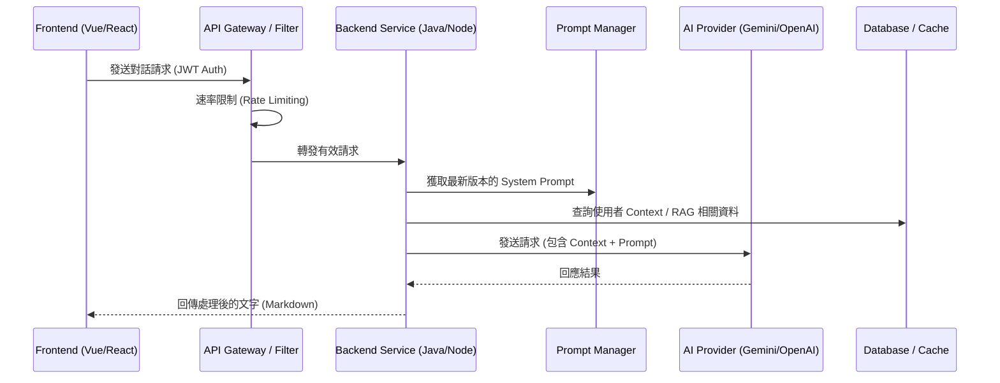
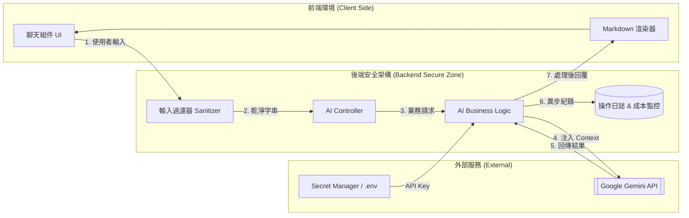

# 業界標準：高維護性 AI 整合架構報告

在現代企業級應用中，整合 AI（如 LLM）不僅僅是呼叫一個 API，更需要考慮系統的**穩定性、可維護性、安全性**以及**使用者體驗 (UX)**。

---

## 1. 核心設計原則

### A. 供應商抽象化 (AI Provider Abstraction)
**做法**: 不要直接在業務邏輯中寫死特定供應商的 SDK。
### B. 流式響應 (Streaming Responses)
**做法**: 使用 SSE (Server-Sent Events) 或 WebSocket 將 AI 產出的文字逐字傳回前端。
### C. 提示詞管理 (Prompt Engineering & Management)
**做法**: 將 Prompt 抽離出代碼，存放於資料庫或專門的 Prompt 管理平台。

---

## 2. 系統序列圖 (Sequence Diagram)

---

## 3. 資料流程圖 (Data Flow Diagram - DFD)

---

## 4. 深度解析：實作步驟 (Step-by-Step)

### 第一步：建立後端代理與安全層 (Safety Layer)
### 第二步：實作 RAG (檢索增強生成)
### 第三步：強化可監控性 (Observability)
### 第四步：非同步與錯誤處理

---

## 5. 總結

高維護性的 AI 模組應具備：安全性、靈活性、體驗優化與透明度。
