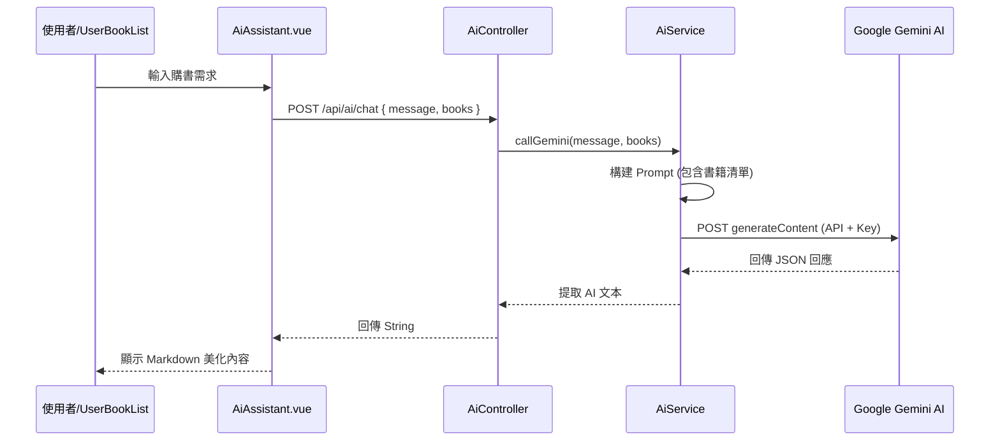

# BookStore AI 模組深度解析報告

此報告針對 `BookStore` 專案中的 AI 模組進行深入分析，涵蓋後端邏輯、前端實作以及雙端串接流程。

## 1. 技術架構概覽

本系統的 AI 功能基於 **Google Gemini (gemini-2.5-flash)** 模型實作，採用經典的「前端需求 -> 後端代理 -> AI 服務」架構。

- **模型版本**: Gemini 2.5 Flash
- **API 供應商**: Google Generative Language API
- **通訊協議**: RESTful API (JSON)

---

## 2. 後端實作解析 (Backend Implementation)

### 核心類別：`AiService.java`
後端邏輯主要封装在 `AiService` 類別中，負責與 Google Gemini API 進行通訊。

- **角色設定 (System Prompt)**:
  系統將 AI 設定為「專業購書顧問」，並注入當前庫存書籍詳情（書名、作者、價格、簡介）作為 Context，確保 AI 的回覆具有真實庫存基礎。
- **安全性**:
  API Key 透過 Spring Boot 的 `@Value("${google.ai.api-key}")` 從設定檔安全讀取。
- **回傳處理**:
  使用 `OkHttpClient` 發送 Request，並透過 `Jackson (ObjectMapper)` 解析 Gemini 回傳的複雜 JSON 結構，提取 `candidates[0].content.parts[0].text`。

### 控制器：`AiController.java`
暴露 HTTP 介面供前端呼叫。
- **Endpoint**: `POST /api/ai/chat`
- **Payload**: `ChatRequest` (包含使用者訊息與當前書籍清單)

---

## 3. 前端實作解析 (Frontend Implementation)

### 核心組件：`AiAssistant.vue`
這是一個基於 Vue 3 + Vuetify 的懸浮式聊天組件。

- **視覺展示**:
  - 使用 `v-fab` 提供懸浮按鈕。
  - 使用 `v-expand-transition` 實作平滑的展開動畫。
  - 訊息區支援 **Markdown** 渲染（透過 `markdown-it`），使 AI 回覆的書名、列表更美觀。
- **狀態管理**:
  - `messages`: 存放對話歷史。
  - `isTyping`: 控制「AI 正在思考中...」的動畫提示。

---

## 4. 前後端串接流程 (Connection Flow)

串接流程如下圖所示：

---

## 5. 重要發現：目前狀態

> [!IMPORTANT]
> 在 `UserBookList.vue` 中發現 `<AiAssistant>` 組件目前是被**註解掉 (Commented out)** 的。
> 若要正式啟用 AI 功能，需在該檔案約第 222 行取消註解。

---

## 6. 建議優化方向

1. **對話記憶 (History)**: 目前每次發送都是獨立請求，建議增加歷史訊息傳遞。
2. **流式輸出 (Streaming)**: 實作 SSE 逐字顯示。
3. **快取機制**: 對於常見問題進行 Redis 快取。
